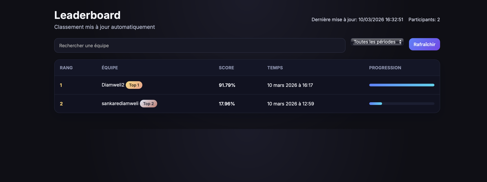

# Competition Baseline (CIFAR-10)
[](https://github.com/Diamweli/DeepLearningCompetition/actions/workflows/ci-test-no-labels.yml)
https://www.kaggle.com/competitions/deep-learning-spring-2025-project-1/data




This repository provides a simple CNN baseline, a submission format, and an evaluation workflow for a CIFAR-10-style image classification competition.

## Repository Structure

- baseline/ : training and inference scripts for a simple CNN model
- evaluation/ : scoring script used by the evaluation workflow
- leaderboard/ : leaderboard update logic
- .github/workflows/ : automated evaluation on pull requests

## Requirements

Python 3.9 is used by the evaluation workflow.

Install dependencies:

```bash
pip install -r baseline/requirements.txt
```

## Train the Baseline Model

This downloads CIFAR-10 and trains a small CNN, then saves `baseline_model.pth`.

```bash
python baseline/train.py
```

The model file is saved in the current working directory.

## Generate Predictions

The prediction script expects test images in a folder, by default `../data/test` relative to `baseline/`, with filenames like `0.png`, `1.png`, ...

1. Update the test directory path in `baseline/predyct.py` if needed.
2. Run the script:

```bash
python baseline/predyct.py
```

This writes `predictions.txt` in the current working directory, with one class id per line.

## Submission Format

Submit a text file with one integer class id per line, ordered the same way as the test images. Example:

```
3
0
7
...
```

## How to Submit

1. Install the encryption dependency:

```bash
pip install cryptography
```

2. Encrypt your predictions with the public key provided in the repository:

```bash
python encryption/encrypt.py --input predictions.txt --output submissions/TEAM_NAME.enc --public-key encryption/public_key.pem
```

3. Place the encrypted file in `submissions/` and create a Pull Request that adds only your `.enc` file.

```bash
git checkout -b submit/TEAM_NAME
mkdir -p submissions
git add submissions/TEAM_NAME.enc
git commit -m "Add encrypted submission"
git push origin submit/TEAM_NAME
```

4. Open a Pull Request to `main` and wait for the automated evaluation.

### Configuration du .gitignore

1. Ajoutez les fichiers sensibles et temporaires à `.gitignore`.
2. Vérifiez qu’ils ne sont plus suivis par Git.

```bash
git status
git rm --cached competition_private_key.pem competition_public_key.pem test_predictions.txt test_team.enc test_predictions.dec
```

### Commit et push vers GitHub

```bash
git add .gitignore baseline/predyct.py baseline/test_no_labels.py README.md encryption/public_key.pem
git commit -m "Sécuriser les labels et les fichiers sensibles"
git push origin main
```

## Guide Technique de Génération de Clés Asymétriques

Ce guide présente les méthodes standard de génération de paires de clés RSA, ECDSA et Ed25519 sur Windows, macOS et Linux, ainsi que les paramètres recommandés pour un usage sécurisé.

### Paramètres utilisés pour la compétition

- Algorithme: RSA
- Taille: 3072 bits
- Chiffrement: RSA-OAEP avec SHA-256
- Clé publique: encryption/public_key.pem
- Clé privée: stockée dans GitHub Secrets via la variable PRIVATE_KEY

### Génération de la paire RSA (exemple recommandé)

```bash
openssl genpkey -algorithm RSA -pkeyopt rsa_keygen_bits:3072 -out private_key.pem
openssl rsa -pubout -in private_key.pem -out public_key.pem
```

### Encodage sécurisé pour GitHub Secrets

```bash
base64 -i private_key.pem > private_key.base64
```

Ajoutez le contenu de `private_key.base64` dans le secret GitHub `PRIVATE_KEY`.

### Choix de l’algorithme

- RSA: compatible et largement accepté, recommandé en 3072 ou 4096 bits
- ECDSA: plus rapide et compact, recommandé avec P-256 ou P-384
- Ed25519: très rapide, signatures courtes, recommandé pour SSH et signatures modernes

### Paramètres recommandés

- RSA: taille de clé 3072 ou 4096, padding OAEP avec SHA-256
- ECDSA: courbes P-256 (généraliste) ou P-384 (plus strict)
- Ed25519: aucune taille à configurer, sécurité moderne par défaut
- Format de sortie: PEM pour compatibilité maximale, DER si requis par l’outil cible

### Génération avec OpenSSL

#### macOS et Linux

RSA 4096:

```bash
openssl genpkey -algorithm RSA -pkeyopt rsa_keygen_bits:4096 -out private_key.pem
openssl rsa -pubout -in private_key.pem -out public_key.pem
```

ECDSA P-256:

```bash
openssl ecparam -genkey -name prime256v1 -noout -out private_key.pem
openssl ec -in private_key.pem -pubout -out public_key.pem
```

Ed25519:

```bash
openssl genpkey -algorithm Ed25519 -out private_key.pem
openssl pkey -in private_key.pem -pubout -out public_key.pem
```

#### Windows (PowerShell)

Assurez-vous qu’OpenSSL est installé et accessible via le PATH, puis utilisez les mêmes commandes que ci-dessus.

### Génération avec OpenSSH (recommandé pour Ed25519)

#### macOS et Linux

```bash
ssh-keygen -t ed25519 -a 100 -f id_ed25519
```

#### Windows

```powershell
ssh-keygen -t ed25519 -a 100 -f id_ed25519
```

### Export PEM et DER

Depuis une clé privée RSA:

```bash
openssl rsa -in private_key.pem -pubout -out public_key.pem
openssl rsa -in private_key.pem -pubout -outform DER -out public_key.der
```

Depuis une clé privée ECDSA:

```bash
openssl ec -in private_key.pem -pubout -out public_key.pem
openssl ec -in private_key.pem -pubout -outform DER -out public_key.der
```

### Bonnes pratiques de sécurité pour la clé privée

- Stocker la clé privée chiffrée et protégée par mot de passe fort
- Ne jamais versionner la clé privée ni la partager par email ou messagerie non chiffrée
- Restreindre les permissions du fichier privé: 600 sur macOS/Linux
- Utiliser un coffre-fort de secrets pour les environnements CI/CD
- Renouveler la paire en cas de doute de compromission

### Vérification d’intégrité locale

Empreinte SHA-256 de la clé publique:

```bash
openssl pkey -pubin -in public_key.pem -outform DER | openssl dgst -sha256
```

### Exemples d’utilisation

Chiffrement et déchiffrement RSA-OAEP:

```bash
openssl pkeyutl -encrypt -pubin -inkey public_key.pem -pkeyopt rsa_padding_mode:oaep -pkeyopt rsa_oaep_md:sha256 -in message.txt -out message.enc
openssl pkeyutl -decrypt -inkey private_key.pem -pkeyopt rsa_padding_mode:oaep -pkeyopt rsa_oaep_md:sha256 -in message.enc -out message.dec
```

Signature et vérification RSA-PSS:

```bash
openssl pkeyutl -sign -inkey private_key.pem -pkeyopt rsa_padding_mode:pss -pkeyopt rsa_pss_saltlen:-1 -pkeyopt digest:sha256 -in message.txt -out signature.bin
openssl pkeyutl -verify -pubin -inkey public_key.pem -pkeyopt rsa_padding_mode:pss -pkeyopt rsa_pss_saltlen:-1 -pkeyopt digest:sha256 -in message.txt -sigfile signature.bin
```

## Protection des labels de test pendant l’inférence

La phase de prédiction filtre uniquement les fichiers images et masque tout fichier de labels détecté dans le répertoire de test.

### Logique appliquée

- Les fichiers considérés comme labels sont ceux dont le nom contient "label" ou "labels" avec extensions `.npy`, `.npz`, `.csv` ou `.txt`.
- Ces labels sont copiés dans `/tmp/masked_labels` et remplacés par des valeurs NaN.
- Les fichiers d’images sont filtrés par extension `.png`, `.jpg`, `.jpeg`, `.bmp` pour empêcher toute lecture accidentelle de labels.

### Tests automatisés

```bash
python baseline/test_no_labels.py
```

### CI: Test et couverture

Le workflow CI exécute `baseline/test_no_labels.py` à chaque push et pull request sur `main` et `master`, génère `coverage.xml`, publie l’artefact, et nettoie les fichiers temporaires `._*` avant et après les tests.

Artefacts visibles dans GitHub Actions:

- coverage.xml

## Protocole Expert de Soumission d’une Clé Publique

Ce protocole décrit un flux standard pour soumettre une clé publique vers une autorité de certification ou un serveur distant, avec validation d’intégrité et vérifications post-soumission.

### Étapes de validation avant soumission

1. Vérifier le format PEM/DER et la lisibilité:

```bash
openssl pkey -pubin -in public_key.pem -text -noout
```

2. Calculer l’empreinte pour intégrité:

```bash
openssl pkey -pubin -in public_key.pem -outform DER | openssl dgst -sha256
```

### Formats de soumission standardisés

- PEM: `public_key.pem` recommandé pour la plupart des API
- DER: `public_key.der` si exigé par l’autorité
- SSH: `id_ed25519.pub` pour serveurs SSH

### Export vers format SSH

```bash
ssh-keygen -y -f private_key.pem > public_key_ssh.pub
```

### Transmission sécurisée

Soumission via HTTPS (API REST):

```bash
curl -X POST https://example.com/api/keys \
  -H "Content-Type: application/x-pem-file" \
  --data-binary @public_key.pem
```

Soumission via SFTP:

```bash
sftp user@server.example.com
put public_key.pem
```

### Vérification post-soumission

1. Récupérer la clé enregistrée et comparer l’empreinte:

```bash
curl -s https://example.com/api/keys/TEAM_NAME | openssl pkey -pubin -outform DER | openssl dgst -sha256
```

2. Vérifier l’usage fonctionnel (exemple signature/validation):

```bash
echo "test" > message.txt
openssl pkeyutl -sign -inkey private_key.pem -in message.txt -out signature.bin
openssl pkeyutl -verify -pubin -inkey public_key.pem -in message.txt -sigfile signature.bin
```

## Local Evaluation (Optional)

If you have the test labels locally, set `TEST_LABELS_PATH` to the `.npy` file and run:

```bash
python evaluation/score.py path/to/predictions.txt
```

This writes `score.json` with the accuracy.
# DeepLearningCompetition

Complete training:
TMPDIR=.tmp TORCH_HOME=.tmp/torch-home EPOCHS=10 MAX_BATCHES=0 MAX_EVAL_BATCHES=0 python3 baseline/train_transfer.py

Predictions:
TMPDIR=.tmp TORCH_HOME=.tmp/torch-home python3 baseline/predict_transfer.py

Scoriing and Leaderboard:
TEAM_NAME="$(git config user.name | tr ' ' '_')" TEST_LABELS_PATH=.tmp/transfer_test_labels.npy python3 evaluation/score.py --predictions .tmp/transfer_predictions.txt --submission "" --output .tmp/transfer_results.json
python3 leaderboard/update_leaderboard.py .tmp/transfer_results.json

Change your name:
git config user.name "VotreNomGitHub"